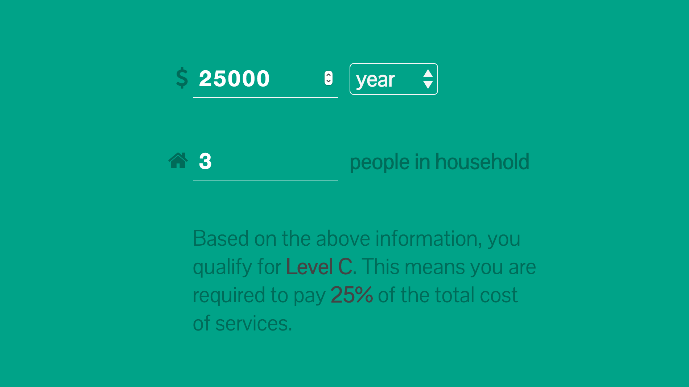

# VDH Services Calculator

Calculates eligibility levels for the VA Department of Health, which are based on **Federal Poverty Level**. Federal Poverty level is calculated using income and household sizes.

This application turns [this reference sheet](reference-sheet.jpg) into a small application that makes the same calculations.

You can view it at **[codeforamerica.github.io/vdh-services-calculator](https://codeforamerica.github.io/vdh-services-calculator)**.

This is a project of [Team RVA](http://rva.codeforamerica.org), a 2015 Fellowship Team at Code for America.